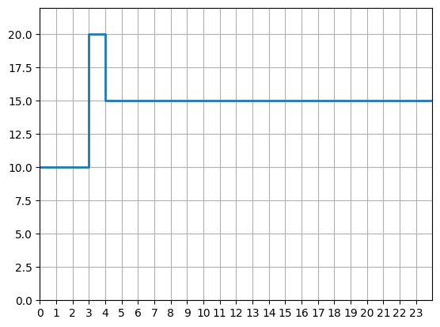
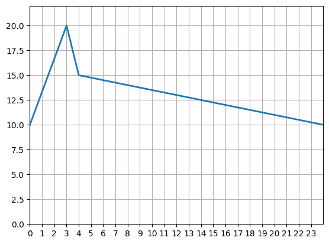

## Component List

### Common parameters
All the components include these three parameters:

- **name** [_string_]: Name of the component.
- **type** [_string_]: Type of the component.
- **description** [_string_]: Description of the component.

### Day_schedule

Component used for simple definition of daily variation of a value.

#### Parameters
- **time_steps** [_int-list_, unit = "s", default = [3600], min = 1]: time steps where the values change. 
- **values** [_float-list_, default = [0,10]]: Values for the time steps defined in the previous parameter. It must always contain one more element than the parameter "time_steps".
- **interpolation** [_option_, default = "STEP", options = ["STEP","LINEAR"]]: Procedure used to obtain the values at each of the simulation instants. "STEP": The value changes in the form of a step. "LINEAR": The value changes linearly between the values defined in the schedule. 

**Example:**
<pre><code class="python">
...

day = osm.components.Day_schedule("day",project)
param = {
    "time_steps": [7200,3600],
    "values": [10,20,15],
    "interpolation": "STEP"
}
day.set_parameters(param)
</code></pre>

The first three hours of the day (7200 s) the value is 10, the next hour (3600 s) 20, and from that instant to the end of the day 15.

 

Using `"interpolation": "LINEAR"` this would be the result

 

### Week_schedule

Component used for simple definition of week variation of a value. It uses to Day_schedule components

#### Parameters
- **days-schedules** [_component-list_, default = ["not_defined"], component type = Day_schedule]: Day_schedule used for the different days of the week. It can contain one value (it will be the one used for all days) or seven values, the Day_schedules for Monday, Tuesday, Wednesday, Thursday, Friday, Saturday and Sunday.

**Example:**
<pre><code class="python">
...

week = osm.components.Week_schedule("week",project)
param = {
    "days_schedules": ["working_day","working_day","working_day","working_day","working_day","holiday_day","holiday_day"]
}
week.set_parameters(param)
</code></pre>

The Day_schedule called "working_day" will be used from Monday to Friday, "holiday_day" will be used on Saturday an Sunday.

### Year_schedule

Component used for simple definition of year variation of a value. It uses to Week_schedule components

#### Parameters
- **periods** [_string-list_, default = ["01/06"]]: Ends of the different periods. Each of them must be in "dd:mm" format. 
The begining of the first period is "01/01" and the end of the last period "31/12"
- **weeks_schedules** [_component-list_, default = ["not_defined","not_defined]]: Week_schedule to be used in the different periods. It must always contain one more element than the parameter "periods".

**Example:**
<pre><code class="python">
...

year = osm.components.Year_schedule("year",pro)
param = {
    "periods": ["31/07","31/08"],
    "weeks_schedules": ["working_week","holiday_week","working_week"]
}
year.set_parameters(param)
</code></pre>

The Week_schedule called "holiday_week" will be used for August and "working_week" for the rest of the year.

#### Variables
- **values**: values obtained using year, weeks and days schedules for each of the simulation time steps.

### File_met

component used to read and manage weather files. Creating the necessary weather variables to be used by other components.

#### Parameters
- **file_name** [_string_, default = "name.met"]: Name of the weather file containing the data. The file must be in MET format. [.MET format (CTE documentation)](https://www.codigotecnico.org/pdf/Documentos/HE/20170202-DOC-DB-HE-0-Climas%20de%20referencia.pdf)

**Example:**
<pre><code class="python">
...

met = osm.components.File_met("met",pro)
met.parameter("file_name").value = "examples/met_files/sevilla.met"
</code></pre>

To generate the variables in the simulation time step, the values are obtained by linear interpolation of the data available in the meteorological file. The variables associated with the solar position are calculated, not obtained from the values stored in the file.

#### Variables
- **temperature** [unit = "°C"]: Dry bulb temperature.
- **sky_temperature** [unit = "°C"]: Sky temperature, for radiant heat exchange.
- **rel_humidity** [unit = "%"]: Air relative hunidity.
- **sol_hour** [unit = "h"]: Solar hour of the day.
- **sol_direct** [unit = "W/m²"]: Direct solar irradiance over horizontal surface.
- **sol_diffuse** [unit = "W/m²"]: Diffuse solar irradiance over horizontal surface.
- **sol_azimut** [unit = "°"]: Solar azimut (degrees from south: E-, W+).
- **sol_altitude** [unit = "°"]: Solar altitude (degrees).
- **wind_speed** [unit = "m/s"]: Wind speed.
- **wind_direction** [unit = "W/m²"]: Wind direction (degrees from north: E+, W-).

### File_data

Component to read temporary data files and use them as simulation variables.

#### Parameters
- **file_name** [_string_, default = "data.csv"]: Name of the file containing the data.
- **file_type** [_option_, default = "CSV", options = ["CSV","EXCEL"]]: Data file type. "CSV", file with the values separated by comma. It must contain a first row with the variable names and from the second row the values for each time step. "EXCEL": excel file with a single sheet and the same format as described for CSV files.
- **file_step** [_option_, default = "SIMULATION", options = ["SIMULATION","OWN"]]: Time step of the data file. The "SIMULATION" option assumes that each of the rows in the data file correspond to the time steps of the project simulation. The "OWN" option will be used when the time step of the data stored in the data file is different from the one used in the simulation. The parameters "initial_time" and "time_step" define the time step of the data in the file.
- **initial_time** [_string_, default = "01/01/2001 00:00:00"]: Initial time of the data file with format "DD/MM/YYYY hh:mm:ss". Only used for the "OWN" option of the "file_step" parameter.
- **time_step** [_int_, unit = "s", default = 3600, min = 1]: Time step in seconds for the data file. Only used for the "OWN" option of the "file_step" parameter.

If we use the "SIMULATION" option of the "file_step" parameter and the number of data in the file is less than the number of time steps during the simulation, to obtain the variables we will go back to the beginning of the data file each time the end of the file is reached.

If we use the "OWN" option of the "file_step" parameter and the simulated time instant is before or after the time instants collected in the file, the first value will be taken if it is before and the last one if it is after. Otherwise a linear interpolation will be performed to obtain the values of each of the simulation steps.

**Example:**
<pre><code class="python">
...

datas = osm.components.File_dat("datas",pro)
param = {
    "file_name": "examples/input_files/data_example.csv",
    "file_type": "CSV",
    "file_step": "SIMULATION",
}
datas.set_parameters(param)
</code></pre>

#### Variables
The component will generate a variable for each of the columns of the data file, 
using as name and unit for the variable the first row of the file. 
The unit must be written after the name in square brackets.

For example for the following CSV file:

<pre><code class="Shell">
n, temperature [ºC], humidity [kg/kg as]
 1, 15.1, 0.00792
 2, 14.6, 0.00788
 3, 14.1, 0.00783
 4, 13.5, 0.00772
 5, 13.0, 0.00766
...
</code></pre>

Three variables will be created with names: n, temperature and humidity. And with the units indicated in square brackets.

### Material

Component to describe the thermal characteristics of the materials used in the enclosures (Construction component).

#### Parameters
- **conductivity** [_float_, unit = "W/(n·K)", default = 1, min = 0]: Material thermal conductivity. 
- **density** [_float_, unit = "kg/m³", default = 1000, min = 0.001]: Material Density.
- **specific_heat** [_float_, unit = "J/(kg·K)", default = 1000, min = 0.001]: Material specific heat.
- **use_resistance** [_boolean_, default = False]: If the value is "False", conductivity, density and specific heat will be used. For "True" value, thermal resistance, density and specific heat will be used. 
- **thermal_resistance** [_float_, unit = "(m²·K)/W", default = 1, min = 0]: Thermal resistance of material layer.

**Example:**
<pre><code class="python">
...

material = osm.components.Material("concrete",project)
param = {
    "conductivity": 1.95,
    "density": 2240,
    "specific_heat": 900,
}
material.set_parameters(param)
</code></pre>

### Construction

Component to describe the composition of the different layers (Material component) of an enclosure.

#### Parameters
- **solar_alpha** [_float-list_, unit = "frac", default = [0.8,0.8], min = 0, max = 1]: Solar absortance for de surfaces 1 and 2.
- **materials** [[_component-list_, default = [], component type = Material]]: Materials list for each of the layers, defined from surface 1 to 2.
- **thicknesses** [_float-list_, unit = "m", default = [], min = 0]: Thicknesses of each of the layers defined in the "materials" parameter. Must have the same number of elements as the "materials" parameter.

**Example:**
<pre><code class="python">
...

construction = osm.components.Construction("Multilayer wall",project)
param = {
    "solar_alpha": [0.8, 0.8],
    "materials": ["Gypsum board","EPS board","Heavyweight concrete","EPS board","Stucco"],
    "thicknesses": [0.016, 0.076, 0.203, 0.076, 0.025],
}
construction.set_parameters(param)
</code></pre>

