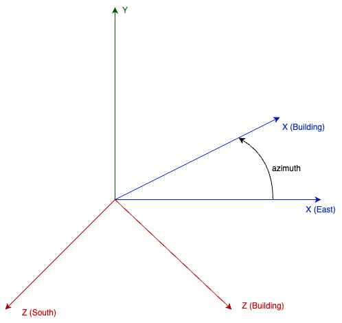

## Component List for building definition elements
### Building

Base component for the definition of a building. The building is made up of a set of spaces (Space component).

#### Parameters
- **file_met** [_component_, default = "not_defined", component type = File_met]: Reference to the component where the weather file is defined.
- **azimuth** [_float_, unit = "°", default = 0, min = -180, max = 180]: Angle formed between the x-axis of the building and the east. The coordinates of all building elements refer to the building coordinate system. 
- **albedo** [_float_, unit = "frac", default = 0.3, min = 0, max = 1]: Solar reflectivity of the ground surrounding the building. Used to calculate the solar radiation reflected to the exterior surfaces of the building.
- **initial_temperature** [_float_, unit = "°C", default = 20]: Initial temperature of all building components at the beginning of the simulation.

The following figure shows the building's coordinate system:

**Example:**
<pre><code class="python">
...

building = osm.components.Building("building",project)
param = {
    "file_met": "met"
    "azimuth": 90,
    "albedo": 0.4
}
building.set_parameters(param)
</code></pre>

### Space_type

Component used to define the type of space. This component will be referenced by all spaces that are of the same type. This component defines the internal loads and some of the functional characteristics of the space.

#### Parameters

- **definition_variables** [_variable_list_, default = []]: List of variables from other components used in the definition. They may be used in parameters of the type math_exp.
- **people_density** [_math_exp_, unit = "p/m²", default = "0.1"]: Occupancy density, defined in persons per m² of floor. The mathematical expression may contain any of the variables declared in the "definition_variables" parameter, to be able to reflect the time variation of this value. See example below
- **people_sensible** [_float_, unit = "W/p", default = 70, min = 0]: Sensible heat generated by each of the occupants of the space.
- **people_latent** [_float_, unit = "W/p", default = 35, min = 0]: Latent heat generated by each of the occupants of the space.
- **people_radiant_fraction** [_float_, unit = "frac", default = 0.6, min = 0, max = 1]: Long wave radiant fraction of heat generated by occupants. The rest of the heat is assumed to be convective.
- **light_density** [_math_exp_, unit = "W/m²", default = "10"]: Lighting density, defined as the electrical lighting power [W] per m² of floor. The mathematical expression may contain any of the variables declared in the "definition_variables" parameter, to be able to reflect the time variation of this value. See example below.
- **light_radiant_fraction** [_float_, unit = "frac", default = 0.6, min = 0, max = 1]: Short wave radiant fraction of heat generated by lights. The rest of the heat is assumed to be convective.
- **other_gains_density** [_math_exp_, unit = "W/m²", default = "10"]: Other gains density, defined as the heat generated by other gains (Household appliances, office automation, miscellaneous electrical equipment, etc.) [W] per m² of floor. The mathematical expression may contain any of the variables declared in the "definition_variables" parameter, to be able to reflect the time variation of this value. See example below.
- **other_gains_radiant_fraction** [_float_, unit = "frac", default = 0.5, min = 0, max = 1]: Long wave radiant fraction of the heat generated by other gains. The convective fraction is calculated by subtracting the radiant and latent fractions.
- **other_gains_latent_fraction** [_float_, unit = "frac", default = 0.0, min = 0, max = 1]: Latent fraction of the heat generated by other gains. The convective fraction is calculated by subtracting the radiant and latent fractions.

- **infiltration** [_math_exp_, unit = "1/h", default = "1"]: Air flow rate infiltrated into the space from outside and expressed in volumes of the space per hour. The mathematical expression may contain any of the variables declared in the "definition_variables" parameter, to be able to reflect the time variation of this value.

Assuming that the variation of occupancy, lighting and other loads has been defined in a "Year_schedule" component, named "schedule" with values between 0 and 1, the following example would capture that variation.

**Example:**
<pre><code class="python">
...

office_space = osm.components.Space_type("office_space",project)
param = {
        "definition_variables": ["f = schedule.value"]
        "people_density": "0.1*f",
        "light_density": "10*f",
        "other_gains_density": "4.2*f",
        "other_gains_radiant_fraction": 0.6,
        "infiltration": "0.5"
}
office_space.set_parameters(param)
</code></pre>

