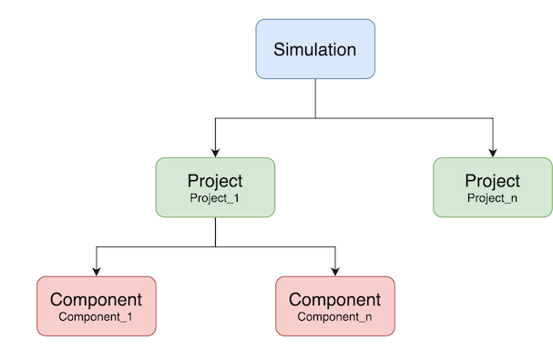

### Getting Started

`OpenSimula` is a component-based time simulation environment in Python. 

The general object structure provided by OpenSimula is composed of three main elements:

- Simulation: The global environment for simulation.
- Project: A set of components that define a problem that can be temporarily simulated.
- Component: These are the base elements on which the simulation is performed. The types of components currently available can be consulted in ...

