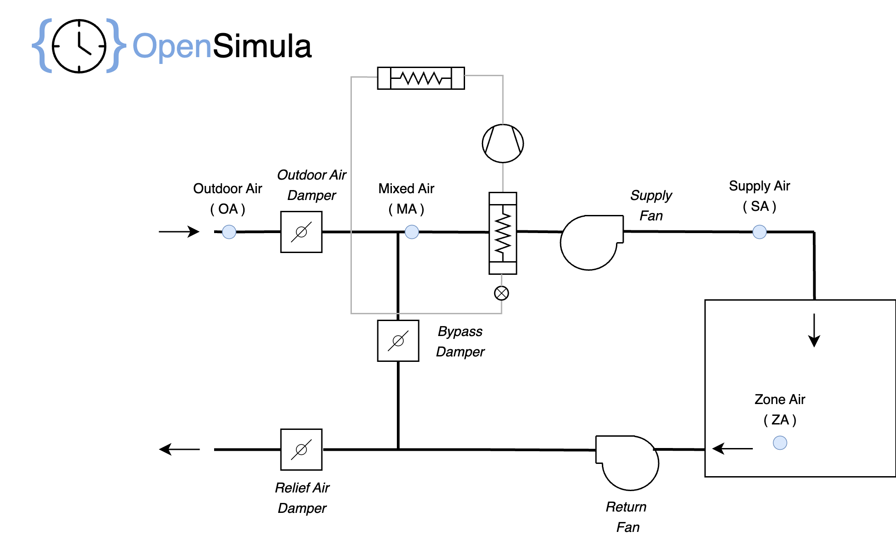
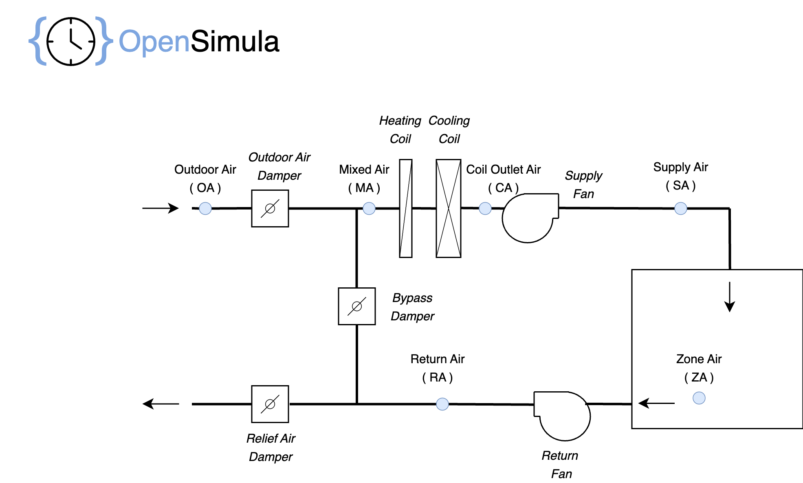
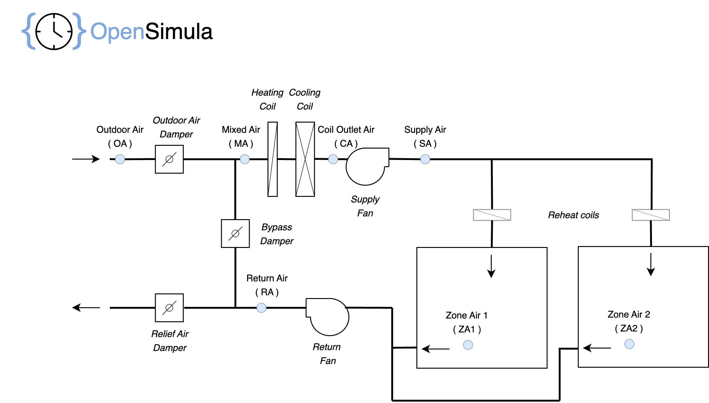

## Component List for HVAC system definition
### HVAC_perfect_system

Component for the perfect conditioning of a space. With this component we can obtain the heating and cooling loads (sensible and latent).

#### Parameters
- **space** [_component_, default = "not_defined", component type = Space]: Reference to the "Space" component to be controlled by this system.
- **input_variables** [_variable_list_, default = []]: List of variables from other components used in this component. They may be used in parameters of the type math_exp.
- **outdoor_air_flow** [_math_exp_, unit = "m³/s", default = "0"]: Outside air flow rate (ventilation) supplied to the space. This flow rate is only entered if the system is in operation. The mathematical expression may contain any of the variables declared in the "input_variables" parameter, to be able to reflect the time variation of this value.
- **heating_setpoint** [_math_exp_, unit = "°C", default = "20"]: Space heating setpoint temperature. The mathematical expression may contain any of the variables declared in the "input_variables" parameter, to be able to reflect the time variation of this value.
- **cooling_setpoint** [_math_exp_, unit = "°C", default = "25"]: Space Cooling setpoint temperature. The mathematical expression may contain any of the variables declared in the "input_variables" parameter, to be able to reflect the time variation of this value.
- **humidifying_setpoint** [_math_exp_, unit = "%", default = "0"]: Space relative humidity setpoint for humidification. If the relative humidity of the space is below this value, latent heat is added to maintain the relative humidity. The mathematical expression may contain any of the variables declared in the "input_variables" parameter, to be able to reflect the time variation of this value.
- **dehumidifying_setpoint** [_math_exp_, unit = "%", default = "100"]: Space relative humidity setpoint for dehumidification. If the relative humidity of the space is higher this value, latent heat is removed to maintain the relative humidity. The mathematical expression may contain any of the variables declared in the "input_variables" parameter, to be able to reflect the time variation of this value.
- **sytem_on_off** [_math_exp_, unit = "on/off", default = "1"]: If this value is 0, the system will be off, otherwise it will be on. The mathematical expression may contain any of the variables declared in the "input_variables" parameter, to be able to reflect the time variation of this value.

The load supplied by the system is that required to maintain the space within the specified temperature and humidity set points, including ventilation if present.

**Example:**
<pre><code class="python">
...

system = osm.components.HVAC_perfect_system("system",project)
param = {
        "spaces": "spaces_1",
        "outdoor_air_flow": "0.1",
        "heating_setpoint": "20",
        "cooling_setpoint": "27",
        "humidifying_setpoint": "30",
        "dehumidifying_setpoint": "70",
        "input_variables":["f = HVAC_schedule.values"],
        "system_on_off": "f"
}
system.set_parameters(param)
</code></pre>

#### Variables

After the simulation we will have the following variables of this component:

- __Q_sensible__ [W]: Sensible heat supplied by the system, positive for heating and negative for cooling.
- __Q_latent__ [W]: Latent heat supplied by the system, positive for humidification, negative for dehumidification.
- __Q_total__ [W]: Total heat supplied by the system, sum of latent and sensible.
- __outdoor_air_flow__ [m³/s]: Outside air flow rate (ventilation) supplied to the space.
- __heating_setpoint__ [°C]: Heating setpoint temperature.
- __cooling_setpoint__ [°C]: Cooling setpoint temperature.
- __humififying_setpoint__ [%]: Low relative humidity setpoint.
- __dehumidifying_setpoint__ [%]: High relative humidity setpoint.
- __state__ [flag]: Operation of the system: off (0), heating (1), colling (-1), venting (3).

### DX_unit

Component to define a direct expansion air conditioning equipment. It can be used to define compact or split 1x1 units. 

This equipment can be used for one or more HVAC systems.

#### Parameters
- **nominal_air_flow** [_float_, unit = "m³/s", default = 1, min = 0]: Nominal inlet air flow.
- **nominal_total_cooling_capacity** [_float_, unit = "W", default = 0, min = 0]: Total cooling gross capacity at nominal cooling conditions.
- **nominal_sensible_cooling_capacity** [_float_, unit = "W", default = 0, min = 0]: Sensible cooling gross capacity at nominal cooling conditions.
- **nominal_cooling_power** [_float_, unit = "W", default = 0, min = 0]: Electrical power consumed by the equipment at nominal cooling conditions. It must include all the consumptions: compressor, external fan, etc. except the power specified in “indoor_fan_power”.
- **indoor_fan_power** [_float_, unit = "W", default = 0, min = 0]: Electrical power consumed by the indoor fan, this power will be added as heat to the air stream.
- **nominal_cooling_conditions** [_float-list_, unit = "ºC", default = [27, 19, 35]]: Nominal cooling conditions, in order: indoor dry bulb temperature, indoor wet bulb temperature, outdoor dry bulb temperature.
- **total_cooling_capacity_expression** [_math_exp_, unit = "frac", default = "1"]: Mathematical expression to correct the total cooling capacity of the equipment in conditions different from the nominal ones. 
- **sensible_cooling_capacity_expression** [_math_exp_, unit = "frac", default = "1"]: Mathematical expression to correct the sensible cooling capacity of the equipment in conditions different from the nominal ones.
- **cooling_power_expression** [_math_exp_, unit = "frac", default = "1"]: Mathematical expression to correct the electric power consumption at cooling full load operation of the equipment in conditions different from the nominal ones.
- **EER_expression** [_math_exp_, unit = "frac", default = "1"]: Mathematical expression to correct the EER, defined as cooling total load supplied by de equipment divided by de electric power consumption, of the equipment in conditions different from the nominal ones. This expression should reflect the partial load behavior of the equipment.
- **nominal_heating_capacity** [_float_, unit = "W", default = 0, min = 0]: Heating capacity at nominal heating conditions.
- **nominal_heating_power** [_float_, unit = "W", default = 0, min = 0]: Electrical power consumed by the equipment at nominal heating conditions. It must include all the consumptions: compressor, external fan, etc, except the power specified in “no_load_power”.
- **nominal_heating_conditions** [_float-list_, unit = "ºC", default = [20, 7, 6]]: Nominal heating conditions, in order: indoor dry bulb temperature, outdoor dry bulb temperature, outdoor wet bulb temperature.
- **heating_capacity_expression** [_math_exp_, unit = "frac", default = "1"]: Mathematical expression to correct the heating capacity of the equipment in conditions different from the nominal ones. 
- **heating_power_expression** [_math_exp_, unit = "frac", default = "1"]: Mathematical expression to correct the electric power consumption at heating full load operation of the equipment in conditions different from the nominal ones.
- **COP_expression** [_math_exp_, unit = "frac", default = "1"]: Mathematical expression to correct the COP, defined as heating load supplied by de equipment divided by de electric power consumption, of the equipment in conditions different from the nominal ones. This expression should reflect the partial load behavior of the equipment.
- **indoor_fan_operation** [_option_, default = "CONTINUOUS", options = ["CONTINUOUS","CYCLING"]]: If the value is “CONTINUOUS” the fan will always run, consuming electrical energy and adding heat to the air stream, even when there is no load. If we specify “CYCLING” the fan will run a fraction of time equal to the partial load at which the equipment operates, therefore, when there is no load there will be no consumption of the fan.
- **dry_coil_model** [_option_, default = "SENSIBLE", options = ["SENSIBLE","TOTAL"]]: When calculating the total and sensible capacity of the equipment under non-nominal conditions, it is possible that the total capacity is lower than the sensible capacity. In such a case it will be assumed that the coil does not dehumidify and that the total capacity is equal to the sensible capacity. We will use for both values the value of the sensible if the chosen option is “SENSIBLE” and the total if the chosen option is “TOTAL”.
- **power_dry_coil_correction** [_boolean_, default = True]: When the total and sensible power are equal, dry coil, the power expression may be incorrect. If this parameter is activated the simulation will look for the wet bulb temperature that makes the total and sensible capacities equal and use that temperature in the expression that corrects the cooling power.
- **expression_max_values** [_float-list_, unit = "-", default = [60,30,60,30,1.5,1]]: Maximum values allowed in the mathematical expressions. The order is [ _T_idb_ [ºC] , _T_iwb_ [ºC] ,_T_odb_ [ºC], _T_owb_ [ºC], _F_air_ [frac], _F_load_ [frac] ]. If any variable exceeds these values, the maximum value is taken.
- **expression_min_values** [_float-list_, unit = "-", default = [0,0,-30,-30,0,0]]: Minimum values allowed in the mathematical expressions. The order is [ _T_idb_ [ºC] , _T_iwb_ [ºC] ,_T_odb_ [ºC], _T_owb_ [ºC], _F_air_ [frac], _F_load_ [frac] ]. If any variable is lower than these values, the minimum value is taken.

All mathematical expressions can include the following independent variables.

- _T_idb_ [ºC]: Indoor dry bulb temperature, at the coil inlet of the indoor unit.
- _T_iwb_ [ºC]: Indoor wet bulb temperature, at the coil inlet of the indoor unit.
- _T_odb_ [ºC]: Outdoor dry bulb temperature.
- _T_owb_ [ºC]: Outdoor wet bulb temperature.
- _F_air_ [frac]: Actual supply air flow divided by nominal supply air flow.

"EER_expression" and "COP_expression" may also include the variable _F_load_, 
which represents the partial load state of the equipment, calculated as the thermal power 
supplied at a given instant divided by the cooling or heating capacity at the current operation conditions.

**Example:**
<pre><code class="python">
...

equipment = osm.components.DX_unit("equipment",project)
param = {
            "nominal_air_flow": 0.417,
            "nominal_total_cooling_capacity": 6000,
            "nominal_sensible_cooling_capacity": 4800,
            "nominal_cooling_power": 2400,
            "indoor_fan_power": 240,
            "indoor_fan_operation": "CONTINUOUS",
            "total_cooling_capacity_expression": "0.88078 + 0.014248 * T_iwb + 0.00055436 * T_iwb**2 - 0.0075581 * T_odb + 3.2983E-05 * T_odb**2 - 0.00019171 * T_odb * T_iwb",
            "sensible_cooling_capacity_expression": "0.50060 - 0.046438 * T_iwb - 0.00032472 * T_iwb**2 - 0.013202 * T_odb + 7.9307E-05 * T_odb**2 + 0.069958 * T_idb - 3.4276E-05 * T_idb**2",
            "cooling_power_expression": "0.11178 + 0.028493 * T_iwb - 0.00041116 * T_iwb**2 + 0.021414 * T_odb + 0.00016113 * T_odb**2 - 0.00067910 * T_odb * T_iwb",
            "EER_expression": "0.20123 - 0.031218 * F_load + 1.9505 * F_load**2 - 1.1205 * F_load**3",
            "nominal_heating_capacity": 6500,
            "nominal_heating_power": 2825,
            "heating_capacity_expression": "0.81474	+ 0.030682602 * T_owb + 3.2303E-05 * T_owb**2",
            "heating_power_expression": "1.2012 - 0.040063 * T_owb + 0.0010877 * T_owb**2",
            "COP_expression": "0.085652 + 0.93881 * F_load - 0.18344 * F_load**2 + 0.15897 * F_load**3"
}
equipment.set_parameters(param)
</code></pre>

### HVAC_DX_system

Component for the simulation of an air-conditioning system for a space and using equipment in direct expansion "DX_unit".

#### Parameters
- **space** [_component_, default = "not_defined", component type = Space]: Reference to the "Space" component to be air-conditioned by this system.
- **equipment** [_component_, default = "not_defined", component type = DX_unit]: Reference to the "DX_unit" component used by this system.
- **air_flow** [_float_, unit = "m³/s", default = 1, min = 0]: Inlet air flow used for all the simulation.
- **outdoor_air_fraction** [_math_exp_, unit = "frac", default = 0]: Outdoor air flow fraction used for the simulation. The outside air is mixed with the return air from the room before it enters the indoor coil.
- **input_variables** [_variable_list_, default = []]: List of variables from other components used in this component. They may be used in parameters of the type math_exp.
- **heating_setpoint** [_math_exp_, unit = "°C", default = "20"]: Space heating setpoint temperature. The mathematical expression may contain any of the variables declared in the "input_variables" parameter, to be able to reflect the time variation of this value.
- **cooling_setpoint** [_math_exp_, unit = "°C", default = "25"]: Space Cooling setpoint temperature. The mathematical expression may contain any of the variables declared in the "input_variables" parameter, to be able to reflect the time variation of this value.
- **sytem_on_off** [_math_exp_, unit = "on/off", default = "1"]: If this value is 0, the system will be off, otherwise it will be on. The mathematical expression may contain any of the variables declared in the "input_variables" parameter, to be able to reflect the time variation of this value.
- **economizer** [_option_, default = "NO", options = ["NO","TEMPERATURE","TEMPERATURE_NOT_INTEGRATED","ENTHALPY","ENTHALPY_LIMITED"]]: Free cooling using outside air (economizer). If the option selected is “NO” no economizer will be used, for the other options the economizer will be used with different control strategies explained below. 
- **economizer_DT** [_float_, unit = "ºC", default = 0, min = 0]: For economizers type “TEMPERATURE” and “TEMPERATURE_NOT_INTEGRATED” set the temperature difference between the return air and the outside air at which the economizer starts to operate.
- **economizer_enthalpy_limit** [_float_, unit = "kJ/kg", default = 0, min = 0]: For economizers type ENTHALPY_LIMITED set the maximun outdoor air enthalpy at which the economizer does not operate.

__Economizer__ 

The different types of economizer operation are as follows:

* "TEMPERATURE": Temperature controlled economizer will be implemented.
* "TEMPERATURE_NOT_INTEGRATED": Temperature controlled economizer will be implemented, this economizer operates the same as the “TEMPERATURE” type but only works when the economizer is able to give the full sensible load of the space.
* "ENTHALPY": Enthalpy controlled economizer will be implemented. It works in the same way as the “TEMPERATURE” type but compares the enthalpies of the return and outside air instead of the temperatures. 
* "ENTHALPY_LIMITED": Enthalpy controlled economizer will be implemented. It works the same as the “ENTHALPY” type but compares the enthalpy of the outside air with the fixed value set in the “economizer_enthalpy_limit” parameter.

The operation of the "TEMPERATURE" economizer control_type is as follows:

* If the outdoor air temperature is higher than the room temperature minus the value of the parameter “economizer_DT”, the economizer does not operate and the outdoor air flow rate is nominal. 
* If the room has cooling load, the outdoor air temperature is lower than the room temperature minus the value of the parameter “economizer_DT", and by increasing the outside air flow rate the entire room load can be provided, the outside air flow rate will be the one required for this purpose.
* If the room has cooling load, the outdoor air temperature is lower than the room temperature minus the value of the parameter “economizer_DT", and the cooling load of the space cannot be provided only with outdoor air, then all the supply air will be outdoor and the coil will provide the remaining sensible cooling load. This mode will not work if the economizer type is “TEMPERATURE_NOT_INTEGRATED”. 

**Example:**
<pre><code class="python">
...

system = osm.components.HVAC_DX_system("system",project)
param = {
        "spaces": "spaces_1",
        "equipment": "HVAC_equipment",
        "air_flow": 0.417,
        "outdoor_air_fraction": 0,
        "heating_setpoint": "20",
        "cooling_setpoint": "27",
        "system_on_off": "1"
}
system.set_parameters(param)
</code></pre>

#### Variables

After the simulation we will have the following variables of this component:

- __state__ [flag]: Operation of the system: off (0), heating (1), heating at maximum capacity (2), colling (-1), cooling at maximum capacity (-2), venting (3).
- __Q_sensible__ [W]: Sensible heat supplied by the system, positive for heating and cooling.
- __Q_latent__ [W]: Latent heat supplied by the system, positive for dehumidification.
- __Q_total__ [W]: Total heat supplied by the system, sensible + latent. 
- __heating_setpoint__ [°C]: Heating setpoint temperature.
- __cooling_setpoint__ [°C]: Cooling setpoint temperature.
- __power__ [W]: Electrical power consumed by the system (including indoor fan).
- __indoor_fan_power__ [W]: Electrical power consumed by the indoor fan.
- __EER__ [frac]: System efficiency ratio for cooling, defined as the total thermal load supplied divided by the electrical power consumed.
- __COP__ [frac]: System efficiency ratio for heating, defined as the thermal load supplied divided by the electrical power consumed.
- __m_air_flow__ [kg/s]: Dry air mass flow rate supplied.       
- __outdoor_air_fraction__ [frac]: fraction of outside air in supply air.       
- __T_OA__ [ºC]: Outdoor air dry bulb temperature.
- __T_OAwb__ [ºC]: Outdoor air wet bulb temperature.
- __T_MA__ [ºC]: Mixed air dry bulb temperature, at the coil inlet of the indoor unit.
- __T_MAwb__ [ºC]: Mixed air wet bulb temperature, at the coil inlet of the indoor unit.
- __F_air__ [frac]: Actual supply air flow divided by nominal supply air flow.
- __F_load__ [frac]: Partial load state of the system, calculated as the thermal power 
supplied at a given instant divided by the cooling or heating capacity at the current operation conditions. Positive for heating and negative for cooling
- __T_SA__ [ºC]: Supply air dry bulb temperature.
- __w_SA__ [g/kg]: Supply air absolute humidity.
- __efficiency_degradation__ [frac]: EER or COP degradation factor obtained from the _EER_expression_ or _COP_expression_ of the equipment.

### Water_coil

Component to define water coil equipment for air heating or cooling. 

This equipment can be used for one or more HVAC systems.

#### Parameters
- **nominal_air_flow** [_float_, unit = "m³/s", default = 1, min = 0]: Nominal inlet air flow.
- **nominal_cooling_water_flow** [_float_, unit = "m³/s", default = 1, min = 0]: Nominal inlet cooling water flow.
- **nominal_total_cooling_capacity** [_float_, unit = "W", default = 0, min = 0]: Total cooling capacity at nominal cooling conditions.
- **nominal_sensible_cooling_capacity** [_float_, unit = "W", default = 0, min = 0]: Sensible cooling capacity at nominal cooling conditions.
- **nominal_cooling_conditions** [_float-list_, unit = "ºC", default = [27, 19, 7]]: Nominal cooling conditions, in order: inlet dry bulb temperature, inlet wet bulb temperature, inlet water temperature.
- **nominal_heating_water_flow** [_float_, unit = "m³/s", default = 1, min = 0]: Nominal inlet heating water flow.
- **nominal_heating_capacity** [_float_, unit = "W", default = 0, min = 0]: Heating capacity at nominal heating conditions.
- **nominal_heating_conditions** [_float-list_, unit = "ºC", default = [20, 15, 50]]: Nominal heating conditions, in order: inlet dry bulb temperature, inlet wet bulb temperature, inlet water temperature.
- **heating_epsilon_expression** [_math_exp_, unit = "frac", default = "1"]: Mathematical expression to correct the heating effectiveness of the equipment in conditions different from the nominal ones. 
- **cooling_epsilon_expression** [_math_exp_, unit = "frac", default = "1"]: Mathematical expression to correct the total cooling effectiveness of the equipment in conditions different from the nominal ones. 
- **cooling_adp_epsilon_expression** [_math_exp_, unit = "frac", default = "1"]: Mathematical expression to correct the ADP cooling effectiveness of the equipment in conditions different from the nominal ones. The ADP effectiveness is defined as 1 - bypass factor.
- **expression_max_values** [_float-list_, unit = "-", default = [60,30,99,2,2]]: Maximum values allowed in the mathematical expressions. The order is [ _T_idb_ [ºC] , _T_iwb_ [ºC] ,_T_iw_ [ºC], _F_air_ [frac], _F_water_ [frac] ]. If any variable exceeds these values, the maximum value is taken.
- **expression_min_values** [_float-list_, unit = "-", default = [-30,-30,0,0,0]]: Minimum values allowed in the mathematical expressions. The order is [ _T_idb_ [ºC] , _T_iwb_ [ºC] ,_T_iw_ [ºC], _F_air_ [frac], _F_water_ [frac] ]. If any variable is lower than these values, the minimum value is taken.

All mathematical expressions can include the following independent variables.

- _T_idb_ [ºC]: Air dry bulb temperature, at the coil inlet.
- _T_iwb_ [ºC]: Air wet bulb temperature, at the coil inlet.
- _T_iw_ [ºC]: Water inlet temperature.
- _F_air_ [frac]: Actual air flow divided by nominal air flow.
- _F_water_ [frac]: Actual water flow divided by nominal cooling or heating water flow.

**Example:**
<pre><code class="python">
...

equipment = osm.components.Water_coil("coil",project)
param = {
        "nominal_air_flow": 0.28536,
        "nominal_heating_capacity": 0,
        "nominal_total_cooling_capacity": 7164,
        "nominal_sensible_cooling_capacity": 5230,
        "nominal_cooling_water_flow": 3.415e-4
}
equipment.set_parameters(param)
</code></pre>

### Fan

Component to define fans. 

This equipment can be used for one or more HVAC systems.

#### Parameters
- **nominal_air_flow** [_float_, unit = "m³/s", default = 1, min = 0]: Nominal air flow.
- **nominal_pressure** [_float_, unit = "Pa", default = 1, min = 0]: Nominal static pressure rise.
- **nominal_power** [_float_, unit = "W", default = 0, min = 0]: Electrical power consumed by the equipment at nominal cooling conditions.
- **pressure_expression** [_math_exp_, unit = "frac", default = "1"]: Mathematical expression to correct the static pressure rise of the equipment in conditions different from the nominal ones. 
- **power_expression** [_math_exp_, unit = "frac", default = "1"]: Mathematical expression to correct the electrical power consumed by the equipment in conditions different from the nominal ones. 

All mathematical expressions can include the following independent variables.

- _F_air_ [frac]: Actual air flow divided by nominal air flow.

**Example:**
<pre><code class="python">
...

equipment = osm.components.Fan("fan",project)
param = {
        "nominal_air_flow":0.28867,
        "nominal_pressure": 498,
        "nominal_power": 201.45,
}
equipment.set_parameters(param)
</code></pre>

### HVAC_SZW_system

Component for the simulation of single zone water air-conditioning system. It can be used for one space conditioning, using coil and fan equipments previously defined.

#### Parameters
- **space** [_component_, default = "not_defined", component type = Space]: Reference to the "Space" component to be air-conditioned by this system.
- **cooling_coil** [_component_, default = "not_defined", component type = Water_coil]: Reference to the "Water_coil" component used for cooling by this system.
- **heating_coil** [_component_, default = "not_defined", component type = Water_coil]: Reference to the "Water_coil" component used for heating by this system.
- **supply_fan** [_component_, default = "not_defined", component type = Fan]: Reference to the "Fan" component used as supply fan by this system.
- **return_fan** [_component_, default = "not_defined", component type = Fan]: Reference to the "Fan" component used as return fan by this system (if present).
- **air_flow** [_float_, unit = "m³/s", default = 1, min = 0]: Coil inlet air flow used for all the simulation.
- **return_air_flow** [_float_, unit = "m³/s", default = 1, min = 0]: Return air flow used if return fan present.
- **outdoor_air_fraction** [_math_exp_, unit = "frac", default = 0]: Outdoor air flow fraction at the coil inlet used for the simulation.
- **input_variables** [_variable_list_, default = []]: List of variables from other components used in this component. They may be used in parameters of the type math_exp.
- **heating_setpoint** [_math_exp_, unit = "°C", default = "20"]: Space heating setpoint temperature. The mathematical expression may contain any of the variables declared in the "input_variables" parameter, to be able to reflect the time variation of this value.
- **cooling_setpoint** [_math_exp_, unit = "°C", default = "25"]: Space cooling setpoint temperature. The mathematical expression may contain any of the variables declared in the "input_variables" parameter, to be able to reflect the time variation of this value.
- **system_on_off** [_math_exp_, unit = "on/off", default = "1"]: If this value is 0, the system will be off, otherwise it will be on. The mathematical expression may contain any of the variables declared in the "input_variables" parameter, to be able to reflect the time variation of this value.
- **fan_operation** [_option_, default = "CONTINUOUS", options = ["CONTINUOUS","CYCLING"]]: If the value is "CONTINUOUS" the fans will always run, consuming electrical energy and adding heat to the air stream, even when there is no load. If we specify "CYCLING" the fans will run a fraction of time equal to the partial load at which the equipment operates, therefore, when there is no load there will be no consumption of the fan.
- **water_source** [_option_, default = "UNKNOWN", options = ["UNKNOWN","WATER_LOOP"]]: If the value is "UNKNOWN", the simulation will be carried out assuming that we always have the defined water flow under the required conditions. If the value is "WATER_LOOP" it has not yet been developed.
- **cooling_water_flow** [_float_, unit = "m³/s", default = 1, min = 0]: Inlet cooling water flow.
- **heating_water_flow** [_float_, unit = "m³/s", default = 1, min = 0]: Inlet heating water flow.
- **inlet_cooling_water_temp** [_float_, unit = "°C", default = 7]: Inlet cooling water temperature used for "UNKNOWN" water source.
- **inlet_heating_water_temp** [_float_, unit = "°C", default = 50]: Inlet heating water temperature used for "UNKNOWN" water source.
- **water_flow_control** [_option_, default = "ON_OFF", options = ["ON_OFF","PROPORTIONAL"]]: If the selected option is "ON_OFF" the coil will operate at design water flow the fraction of time necessary to give the sensible load (F_load) and zero flow the rest of the time, therefore the latent load will be calculated by multiplying the latent load at design flow by that fraction of time. If we select "PROPORTIONAL" it is assumed that the water flow rate is adjusted progressively, the required coil outlet temperature will be calculated and using the adp effectiveness the ADP and the supplied latent load will be obtained.
- **economizer** [_option_, default = "NO", options = ["NO","TEMPERATURE","TEMPERATURE_NOT_INTEGRATED","ENTHALPY","ENTHALPY_LIMITED"]]: Free cooling using outside air (economizer). If the option selected is "NO" no economizer will be used, for the other options the economizer see HVAC_DX_system.
- **economizer_DT** [_float_, unit = "ºC", default = 0, min = 0]: For economizers type "TEMPERATURE" and "TEMPERATURE_NOT_INTEGRATED" set the temperature difference between the return air and the outside air at which the economizer starts to operate.
- **economizer_enthalpy_limit** [_float_, unit = "kJ/kg", default = 0, min = 0]: For economizers type ENTHALPY_LIMITED set the maximum outdoor air enthalpy at which the economizer does not operate.

**Example:**
<pre><code class="python">
...

system = osm.components.HVAC_SZW_system("system",project)
param = {
        "space": "space_1",
        "cooling_coil": "cooling_coil",
        "heating_coil": "heating_coil",
        "supply_fan": "supply_fan",
        "air_flow": 0.28536,
        "outdoor_air_fraction": "0.33333",
        "cooling_water_flow": 3.415e-4,
        "cooling_setpoint": "23.333",
        "heating_setpoint": "20",
        "system_on_off": "1",
}
system.set_parameters(param)
</code></pre>

#### Variables

After the simulation we will have the following variables of this component:

- __state__ [flag]: Operation of the system: off (0), heating (1), heating at maximum capacity (2), cooling (-1), cooling at maximum capacity (-2), venting (3).
- __Q_sensible__ [W]: Sensible heat supplied by the coil, positive for heating and negative for cooling.
- __Q_latent__ [W]: Latent heat removed by the coil, positive for dehumidification.
- __Q_total__ [W]: Total heat supplied by the coil, sensible + latent.
- __heating_setpoint__ [°C]: Heating setpoint temperature.
- __cooling_setpoint__ [°C]: Cooling setpoint temperature.
- __supply_fan_power__ [W]: Electrical power consumed by the supply fan.
- __return_fan_power__ [W]: Electrical power consumed by the return fan.
- __m_air_flow__ [kg/s]: Dry air mass flow rate at coil inlet.
- __m_return_air_flow__ [kg/s]: Dry air mass flow rate in return air.
- __outdoor_air_fraction__ [frac]: Fraction of outside air in supply air.
- __T_OA__ [ºC]: Outdoor air dry bulb temperature.
- __T_OAwb__ [ºC]: Outdoor wet bulb temperature.
- __T_MA__ [ºC]: Mixed air dry bulb temperature, at the coil inlet.
- __T_MAwb__ [ºC]: Mixed air wet bulb temperature, at the coil inlet.
- __T_RA__ [ºC]: Return air dry bulb temperature (after return fan if present).
- __F_load__ [frac]: Partial load state of the system, calculated as the thermal power supplied at a given instant divided by the cooling or heating capacity at the current operation conditions.
- __T_CA__ [ºC]: Coil outlet air dry bulb temperature.
- __w_CA__ [g/kg]: Coil outlet air absolute humidity.
- __T_SA__ [ºC]: Supply air dry bulb temperature (after supply fan).
- __w_SA__ [g/kg]: Supply air absolute humidity.
- __T_iw__ [ºC]: Coil inlet water temperature.
- __T_ow__ [ºC]: Coil outlet water temperature.
- __T_ADP__ [ºC]: ADP (Apparatus Dew Point) temperature of the coil.
- __epsilon__ [frac]: Coil effectiveness.
- __epsilon_adp__ [frac]: Coil ADP effectiveness = 1 - Bypass Factor.

### HVAC_MZW_system

Component for the simulation of multi-zone water air-conditioning system. It can be used for multiple spaces conditioning, using coil and fan equipments previously defined. This system supports VAV (Variable Air Volume) and reheat configurations.

#### Parameters
- **spaces** [_component_list_, default = ["not_defined", "not_defined"], component type = Space]: List of references to the "Space" components to be air-conditioned by this system.
- **air_flow_fractions** [_float_list_, unit = "frac", default = [0.5, 0.5], min = 0, max = 1]: Fraction of total supply air flow assigned to each space. The sum of all fractions must equal 1.
- **cooling_coil** [_component_, default = "not_defined", component type = Water_coil]: Reference to the "Water_coil" component used for cooling by this system.
- **heating_coil** [_component_, default = "not_defined", component type = Water_coil]: Reference to the "Water_coil" component used for central heating by this system.
- **supply_fan** [_component_, default = "not_defined", component type = Fan]: Reference to the "Fan" component used as supply fan by this system.
- **return_fan** [_component_, default = "not_defined", component type = Fan]: Reference to the "Fan" component used as return fan by this system (if present).
- **air_flow** [_float_, unit = "m³/s", default = 1, min = 0]: Total system air flow at coil inlet for desgin conditions.
- **return_air_flow** [_float_, unit = "m³/s", default = 1, min = 0]: Total return air flow at design conditions, used if return fan present.
- **return_air_flow_fractions** [_float_list_, unit = "frac", default = [0.5, 0.5], min = 0, max = 1]: Fraction of return air flow from each space. The sum of all fractions must equal 1.
- **min_air_flow_fractions** [_float_list_, unit = "frac", default = [0.3333, 0.4286], min = 0, max = 1]: Minimum air flow fraction for each space when VAV is enabled.
- **outdoor_air_fraction** [_math_exp_, unit = "frac", default = "0"]: Outdoor air flow fraction at the coil inlet used for the simulation.
- **input_variables** [_variable_list_, default = []]: List of variables from other components used in this component. They may be used in parameters of the type math_exp.
- **supply_heating_setpoint** [_math_exp_, unit = "°C", default = "10"]: Supply air heating setpoint temperature. The mathematical expression may contain any of the variables declared in the "input_variables" parameter.
- **supply_cooling_setpoint** [_math_exp_, unit = "°C", default = "15"]: Supply air cooling setpoint temperature. The mathematical expression may contain any of the variables declared in the "input_variables" parameter.
- **heating_setpoint_position** [_option_, default = "SYSTEM_OUTPUT", options = ["SYSTEM_OUTPUT","COIL_OUTPUT"]]: Position where heating setpoint is controlled. "SYSTEM_OUTPUT" controls temperature after supply fan, "COIL_OUTPUT" controls at coil outlet.
- **cooling_setpoint_position** [_option_, default = "SYSTEM_OUTPUT", options = ["SYSTEM_OUTPUT","COIL_OUTPUT"]]: Position where cooling setpoint is controlled. "SYSTEM_OUTPUT" controls temperature after supply fan, "COIL_OUTPUT" controls at coil outlet.
- **spaces_setpoint** [_math_exp_list_, unit = "°C", default = ["20", "20"]]: Space temperature setpoint for each zone. Used for reheat and VAV control.
- **system_on_off** [_math_exp_, unit = "on/off", default = "1"]: If this value is 0, the system will be off, otherwise it will be on. The mathematical expression may contain any of the variables declared in the "input_variables" parameter.
- **fan_operation** [_option_, default = "CONTINUOUS", options = ["CONTINUOUS","CYCLING"]]: If the value is "CONTINUOUS" the fans will always run, consuming electrical energy and adding heat to the air stream, even when there is no load. If we specify "CYCLING" the fans will run a fraction of time equal to the partial load at which the equipment operates.
- **water_source** [_option_, default = "UNKNOWN", options = ["UNKNOWN","WATER_LOOP"]]: If the value is "UNKNOWN", the simulation will be carried out assuming that we always have the defined water flow under the required conditions. If the value is "WATER_LOOP" it has not yet been developed.
- **cooling_water_flow** [_float_, unit = "m³/s", default = 1, min = 0]: Inlet cooling water flow.
- **heating_water_flow** [_float_, unit = "m³/s", default = 1, min = 0]: Inlet heating water flow.
- **inlet_cooling_water_temp** [_float_, unit = "°C", default = 7]: Inlet cooling water temperature used for "UNKNOWN" water source.
- **inlet_heating_water_temp** [_float_, unit = "°C", default = 50]: Inlet heating water temperature used for "UNKNOWN" water source.
- **water_flow_control** [_option_, default = "ON_OFF", options = ["ON_OFF","PROPORTIONAL"]]: If the selected option is "ON_OFF" the coil will operate at design water flow the fraction of time necessary to give the sensible load (F_load) and zero flow the rest of the time. If we select "PROPORTIONAL" it is assumed that the water flow rate is adjusted progressively.
- **economizer** [_option_, default = "NO", options = ["NO","TEMPERATURE","TEMPERATURE_NOT_INTEGRATED","ENTHALPY","ENTHALPY_LIMITED"]]: Free cooling using outside air (economizer). If the option selected is "NO" no economizer will be used, for the other options the economizer see HVAC_DX_system.
- **economizer_DT** [_float_, unit = "ºC", default = 0, min = 0]: For economizers type "TEMPERATURE" and "TEMPERATURE_NOT_INTEGRATED" set the temperature difference between the return air and the outside air at which the economizer starts to operate.
- **economizer_enthalpy_limit** [_float_, unit = "kJ/kg", default = 0, min = 0]: For economizers type ENTHALPY_LIMITED set the maximum outdoor air enthalpy at which the economizer does not operate.
- **reheat** [_boolean_, default = False]: Enable reheat coils for each zone.
- **vav** [_boolean_, default = False]: Enable Variable Air Volume (VAV) control for each zone.
- **reheat_coils** [_component_list_, default = ["not_defined", "not_defined"], component type = Water_coil]: List of reheat coil references for each zone (required if reheat is enabled).

**Example:**
<pre><code class="python">
...

system = osm.components.HVAC_MZW_system("system",project)
param = {
        "spaces": ["space_1", "space_2"],
        "air_flow_fractions": [0.6, 0.4],
        "cooling_coil": "cooling_coil",
        "heating_coil": "heating_coil",
        "supply_fan": "supply_fan",
        "air_flow": 0.5,
        "outdoor_air_fraction": "0.2",
        "cooling_water_flow": 5e-4,
        "supply_cooling_setpoint": "13",
        "supply_heating_setpoint": "40",
        "spaces_setpoint": ["22", "20"],
        "system_on_off": "1",
        "vav": True,
        "reheat": True,
        "reheat_coils": ["reheat_coil_1", "reheat_coil_2"]
}
system.set_parameters(param)
</code></pre>

#### Variables

After the simulation we will have the following variables of this component:

- __state__ [flag]: Operation of the system: off (0), heating (1), heating at maximum capacity (2), cooling (-1), cooling at maximum capacity (-2), venting (3).
- __Q_sensible__ [W]: Sensible heat supplied by the main coil, positive for heating and negative for cooling.
- __Q_latent__ [W]: Latent heat removed by the coil, positive for dehumidification.
- __Q_total__ [W]: Total heat supplied by the main coil, sensible + latent.
- __supply_heating_setpoint__ [°C]: Supply air heating setpoint temperature.
- __supply_cooling_setpoint__ [°C]: Supply air cooling setpoint temperature.
- __supply_fan_power__ [W]: Electrical power consumed by the supply fan.
- __return_fan_power__ [W]: Electrical power consumed by the return fan.
- __m_air_flow__ [kg/s]: Total dry air mass flow rate at coil inlet.
- __m_return_air_flow__ [kg/s]: Total dry air mass flow rate in return air.
- __F_flow__ [frac]: Total system air flow fraction (for VAV systems).
- __outdoor_air_fraction__ [frac]: Fraction of outside air in supply air.
- __T_OA__ [ºC]: Outdoor air dry bulb temperature.
- __T_OAwb__ [ºC]: Outdoor wet bulb temperature.
- __T_MA__ [ºC]: Mixed air dry bulb temperature, at the coil inlet.
- __T_MAwb__ [ºC]: Mixed air wet bulb temperature, at the coil inlet.
- __T_ZA__ [ºC]: Mixed zone air temperature (weighted average from all zones).
- __T_RA__ [ºC]: Return air dry bulb temperature (after return fan if present).
- __w_RA__ [g/kg]: Return air absolute humidity.
- __F_load__ [frac]: Partial load state of the system, calculated as the thermal power supplied at a given instant divided by the cooling or heating capacity at the current operation conditions.
- __T_CA__ [ºC]: Coil outlet air dry bulb temperature.
- __w_CA__ [g/kg]: Coil outlet air absolute humidity.
- __T_SA__ [ºC]: Supply air dry bulb temperature (after supply fan).
- __w_SA__ [g/kg]: Supply air absolute humidity.
- __T_iw__ [ºC]: Coil inlet water temperature.
- __T_ow__ [ºC]: Coil outlet water temperature.
- __T_ADP__ [ºC]: ADP (Apparatus Dew Point) temperature of the coil.
- __epsilon__ [frac]: Coil effectiveness.
- __epsilon_adp__ [frac]: Coil ADP effectiveness = 1 - Bypass Factor.

For each space (i = 0, 1, 2, ...):
- __spaces_setpoint_i__ [°C]: Temperature setpoint for space i.
- __Q_reheat_i__ [W]: Reheat power supplied to space i (if reheat enabled).
- __T_SA_i__ [ºC]: Supply air temperature to space i (after reheat if enabled).
- __m_air_flow_i__ [kg/s]: Air mass flow rate supplied to space i.
- __F_flow_i__ [frac]: Air flow fraction for space i (relative to nominal flow).

