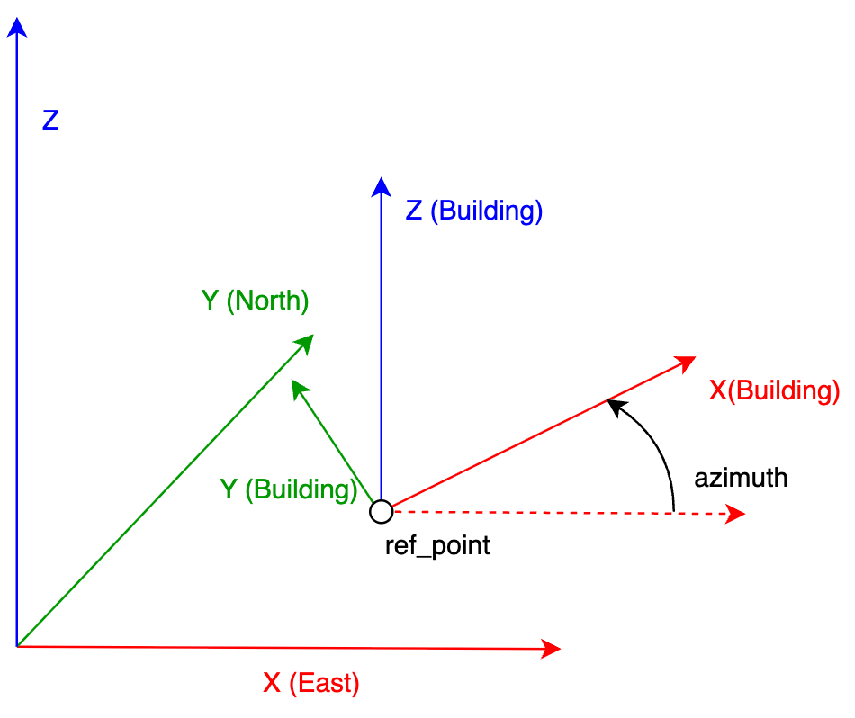
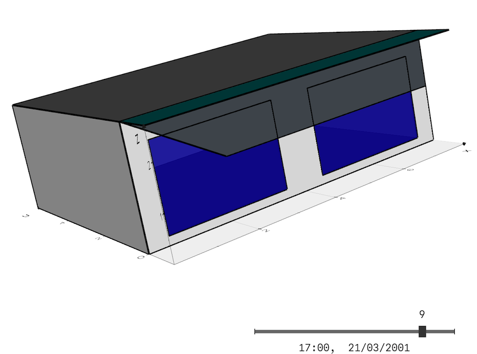

## Component List for building definition elements
### Building

Base component for the definition of a building. The building is made up of a set of spaces (Space component).

#### Parameters
- **azimuth** [_float_, unit = "°", default = 0, min = -180, max = 180]: Angle formed between the x-axis of the building and the east (Global x-axis). The coordinates of all building elements refer to the building coordinate system. 
- **ref_point** [_float-list_, unit = "m", default = [0,0,0]]: Three-dimensional coordinate of the building reference point (coordinates origin). All surfaces in the building will be defined relative to the building's coordinate origin.
- **initial_temperature** [_float_, unit = "°C", default = 20]: Initial temperature of all building components at the beginning of the simulation.
- **initial_humidity** [_float_, unit = "g/kg", default = 7.3]: Initial absolute humidity of all building spaces at the beginning of the simulation.

The following figure shows the building's coordinate system:

**Example:**
<pre><code class="python">
...

building = osm.components.Building("building",project)
param = {
    "azimuth": 90
    "ref_point": [10,10,0]
}
building.set_parameters(param)
</code></pre>

### Space_type

Component used to define the type of space. This component will be referenced by all spaces that are of the same type. This component defines the internal loads and some of the functional characteristics of the space.

#### Parameters

- **input_variables** [_variable_list_, default = []]: List of variables from other components used in this component. They may be used in parameters of the type math_exp.
- **people_density** [_math_exp_, unit = "p/m²", default = "0.1"]: Occupancy density, defined in persons per m² of floor. The mathematical expression may contain any of the variables declared in the "input_variables" parameter, to be able to reflect the time variation of this value. See example below
- **people_sensible** [_float_, unit = "W/p", default = 70, min = 0]: Sensible heat generated by each of the occupants of the space.
- **people_latent** [_float_, unit = "W/p", default = 35, min = 0]: Latent heat generated by each of the occupants of the space.
- **people_radiant_fraction** [_float_, unit = "frac", default = 0.6, min = 0, max = 1]: Long wave radiant fraction of heat generated by occupants. The rest of the heat is assumed to be convective.
- **light_density** [_math_exp_, unit = "W/m²", default = "10"]: Lighting density, defined as the electrical lighting power [W] per m² of floor. The mathematical expression may contain any of the variables declared in the "input_variables" parameter, to be able to reflect the time variation of this value. See example below.
- **light_radiant_fraction** [_float_, unit = "frac", default = 0.6, min = 0, max = 1]: Short wave radiant fraction of heat generated by lights. The rest of the heat is assumed to be convective.
- **other_gains_density** [_math_exp_, unit = "W/m²", default = "10"]: Other gains density, defined as the heat generated by other gains (Household appliances, office automation, miscellaneous electrical equipment, etc.) [W] per m² of floor. The mathematical expression may contain any of the variables declared in the "input_variables" parameter, to be able to reflect the time variation of this value. See example below.
- **other_gains_radiant_fraction** [_float_, unit = "frac", default = 0.5, min = 0, max = 1]: Long wave radiant fraction of the heat generated by other gains. The convective fraction is calculated by subtracting the radiant and latent fractions.
- **other_gains_latent_fraction** [_float_, unit = "frac", default = 0.0, min = 0, max = 1]: Latent fraction of the heat generated by other gains. The convective fraction is calculated by subtracting the radiant and latent fractions.
- **infiltration** [_math_exp_, unit = "1/h", default = "1"]: Air flow rate infiltrated into the space from outside and expressed in volumes of the space per hour. The mathematical expression may contain any of the variables declared in the "input_variables" parameter, to be able to reflect the time variation of this value.

Assuming that the variation of occupancy, lighting and other loads has been defined in a "Year_schedule" component, named "schedule" with values between 0 and 1, the following example would capture that variation.

**Example:**
<pre><code class="python">
...

office_space = osm.components.Space_type("office_space",project)
param = {
        "input_variables": ["f = schedule.values"]
        "people_density": "0.1*f",
        "light_density": "10*f",
        "other_gains_density": "4.2*f",
        "other_gains_radiant_fraction": 0.6,
        "infiltration": "0.5"
}
office_space.set_parameters(param)
</code></pre>

#### Variables

After the simulation we will have the following variables of this component:

- __people_convective__ [W/m²]: Convective heat due to occupancy.
- __people_radiant__ [W/m²]: Radiant heat (long wave) due to occupancy.
- __people_latent__ [W/m²]: Latent heat due to occupancy.
- __light_convective__ [W/m²]: Convective heat due to lighting.
- __light_radiant__ [W/m²]: Radiant heat (short wave) due to lighting.
- __other_gains_convective__ [W/m²]: Convective heat due to other gains.
- __other_gains_radiant__ [W/m²]: Radiant heat (long wave) due to other gains.
- __other_gains_latent__ [W/m²]: Latent heat due to other gains.
- __infiltration_rate__ [1/h]: Air flow rate infiltrated into the space from outside, expressed in volumes of the space per hour.

### Space

Component used to define each of the building's spaces. The spaces of a building are each of the volumes of the building where we can find a different temperatures. The spaces will be referenced by the different surfaces that comprise them.

#### Parameters

- **building** [_component_, default = "not_defined", component type = Building]: Reference to the "Building" component of which it is a part.
- **space_type** [_component_, default = "not_defined", component type = Space_type]: Reference to the "Space_type" component that defines its occupational and functional characteristics.
- **floor_area** [_float_, unit = "m²", default = 1, min = 0]: Floor area of the space.
- **volume** [_float_, unit = "m³", default = 1, min = 0]: Volume of the space.
- **furniture_weight** [_float_, unit = "kg/m²", default = 10, min = 0]: Weight of the furniture in the space. Used to increase the thermal inertia of the space which will be added to that of the air (for the furniture a specific heat of 1000 J/kg·K will be used).
- **convergence_DT** [_float_, unit = "°C", default = 0.01, min = 0]: Convergence temperature difference. In the iterative process, convergence will be considered to have occurred when the temperature difference between two successive iterations is less than this value.
- **convergence_Dw** [_float_, unit = "g/kg", default = 0.01, min = 0]: Convergence hunidity difference. In the iterative process, convergence will be considered to have occurred when the absolute humidity difference between two successive iterations is less than this value.

**Example:**
<pre><code class="python">
...

space_1 = osm.components.Space("spaces_1",project)
param = {
        "building": "building",
        "spaces_type": "office_space",
        "floor_area": 30,
        "volume": 90
}
space_1.set_parameters(param)
</code></pre>

#### Variables

After the simulation we will have the following variables of this component:

- __temperature__ [°C]: Space dry air temperature.
- __abs_humidity__ [g/kg]: Absolute space air humidity.
- __rel_humidity__ [%]: Relative space air humidity.
- __people_convective__ [W]: Convective heat due to occupancy.
- __people_radiant__ [W]: Radiant heat (long wave) due to occupancy.
- __people_latent__ [W]: Latent heat due to occupancy.
- __light_convective__ [W]: Convective heat due to lighting.
- __light_radiant__ [W]: Radiant heat (short wave) due to lighting.
- __other_gains_convective__ [W]: Convective heat due to other gains.
- __other_gains_radiant__ [W]: Radiant heat (long wave) due to other gains.
- __other_gains_latent__ [W]: Latent heat due to other gains.
- __solar_direct_gains__ [W]: Direct solar radiation gains.
- __infiltration_flow__ [m³/s]: Air flow rate infiltrated into the space from outside.
- __infiltration_sensible_heat__ [W]: Sensible heat due to air infiltration from outdoor.
- __surfaces_convective__ [W]: Convective heat flux exchanged between interior surfaces and space air.
- __delta_int_energy__ [W]: Increase of internal energy of the space (air and furniture).
- __u_system_sensible_heat__ [W]: Sensible heat introduced by uncontrolled systems in space. Spaces can collect airflows from various types of systems, those that are not capable of controlling the room temperature are called ‘uncontrolled systems’. For example, a flow of outside air, a flow from a dedicated outdoor air system, etc.
- __u_system_sensible_latent__ [W]: Latent heat introduced by uncontrolled systems in space.
- __system_sensible_heat__ [W]: Sensible heat introduced by the system responsible for space control. Positive for heating and negative for cooling.
- __system_sensible_latent__ [W]: Latent heat introduced by control system in space. Positive for humidification and negative for dehumidification.

### Building_surface

Component to define the Building surfaces of the building: vertical or inclined walls,horizontal or inclined roofs, interior walls, slabs, underground walls, etc.

#### Parameters

- **shape** [_option_, default = "RECTANGLE", options = ["RECTANGLE","POLYGON"]]: Shape of the surface, for a rectangle the parameters "width" and "height" will be used and for a polygon the parameters "x-polygon" and "y-polygon". 
- **width** [_float_, unit = "m", default = 1, min = 0]: Width of the rectangular surface. Only used if "shape" is equal to "RECTANGLE". 
- **height** [_float_, unit = "m", default = 1, min = 0]: Height of the rectangular surface. Only used if "shape" is equal to "RECTANGLE". 
- **ref_point** [_float-list_, unit = "m", default = [0,0,0]]: Three-dimensional coordinate of the surface reference point. For rectangular surfaces the lower left corner of the surface viewed from the outside (side 0), for surfaces defined by polygons the three-dimensional location of the coordinate origin used to define the polygon in two dimensions.
- **x_polygon** [_float-list_, unit = "m", default = [0,10,10,0]]: List with the x-coordinates of the points defining the surface polygon. Only used if "shape" is equal to "POLYGON". 
- **y_polygon** [_float-list_, unit = "m", default = [0,0,10,10]]: List with the y-coordinates of the points defining the surface polygon. Only used if "shape" is equal to "POLYGON".
- **azimuth** [_float_, unit = "°", default = 0, min = -180, max = 180]: Angle formed between the x-axis of the building and the projection of the x-axis of the surface.
- **altitude** [_float_, unit = "°", default = 0, min = -90, max = 90]: Angle formed between the z-axis of the building and the y-axis of the surface.
- **surface_type** [_option_, default = "EXTERIOR", options = ["EXTERIOR", "INTERIOR", "UNDERGROUND", "VIRTUAL"]]: Surface type: “EXTERIOR” for exterior walls, roofs, and ceilings; “INTERIOR” for interior walls or floors; ‘UNDERGROUND’ for buried walls or floors in contact with the ground; and “VIRTUAL” used to define gaps between two spaces. Spaces in opensimula must be completely enclosed by surfaces for the radiant exchange calculation to work correctly.
- **construction** [_component_, default = "not_defined", component type = Construction]: Reference to the "Construction" component that defines its composition, not used for "VIRTUAL" surface_type.
- **spaces** [_component-list_, default = ["not_defined","not_defined], component type = Space]: Reference to the "Space" components for the side 0 and the side 1 in "INTERIOR" and "VIRTUAL" surface_type. For "EXTERIOR" and "UNDERGROUND" only de first element fo de list is used.
- **h_cv** [_float-list_, unit = "W/m²K", default = [19.3,2], min = 0]: Convective film coefficients of the exterior and interior surfaces or side 0 and 1, respectively. For "VIRTUAL" surface_type these values are not used, and for "UNDERGROUND" the first value is the exterior ground surface coefficient and the second is the interior coefficient.
- **ground_material** [_component_, default = "not_defined", component type = Material]: Reference to the "Material" component that defines the ground thermal properties, used only for "UNDERGROUND" surface_type. A exterior layer of this material (0.5 m) will be added to the construction.
- **exterior_perimeter_fraction** [_float_, unit = "frac", default = 1, min = 0, max = 1]: Part of the outer perimeter of the enclosure that is in contact with the ground outside the building. Used only for "UNDERGROUND" surface_type.
- **exterior_perimeter_wall_thickness** [_float_, unit = "m", default = 0.3, min = 0]: Thickness of the exterior walls surrounding the slab in contact with the ground. Used only for "UNDERGROUND" surface_type.
- **groundwater_depth** [_float_, unit = "m", default = 0, min = 0]: Depth at which the water table is found. The average annual temperature at that depth is used. If its value is 0, there is no water table. Used only for "UNDERGROUND" surface_type.

The following figures show the surface coordinate system versus the building coordinate system for rectangular or polygonal surfaces.

The simulation of slabs in contact with the ground is carried out for the “UNDERGROUND” surface_type in accordance with the provisions of standard UNE-EN ISO 13370:2017 in Appendix F: Application to dynamic calculation programs.

**Example:**
<pre><code class="python">
...

north_wall = osm.components.Building_surface("north_wall",project)
param = {
        "ref_point": [8,0,-6],
        "width": 8,
        "height": 2.7,
        "azimuth": 180,
        "altitude": 0,
        "surface_type": "EXTERIOR"
        "construction": "Multilayer_wall",
        "spaces": ["space_1"]
}
north_wall.set_parameters(param)
</code></pre>

#### Variables

After the simulation we will have the following variables of this component, all variables ending in 0 refer to the outer surface and those ending in 1 to the inner surface:

- __T_s0, T_s1__ [°C]: Surface temperatures
- __q_cd0, q_cd1__ [W/m²]: Conductive heat flux at the surfaces.
- __q_cv0, q_cv1__ [W/m²]: Convective heat flux at the surfaces.
- __q_sol0, q_sol1__ [W/m²]: Solar heat flux at the surfaces.
- __q_swig0, q_swig1__ [W/m²]: Radiant short wave heat flux at the surfaces due to internal gains.
- __q_lwig0, q_lwig1__ [W/m²]: Radiant long wave heat flux at the surfaces due to internal gains.
- __q_lwt0, q_lwt1__ [W/m²]: Radiant long wave heat flux at the surfaces due other surfaces temperatures.
- __p_0, p_1__ [W/m²]: Conductive heat flux at the surfaces due to previous time steps.
- __T_rm__ [°C]: Exterior radiant mean temperature.
- __E_dir__ [W/m²]: Direct solar radiation incident on the exterior surface.
- __E_dif__ [W/m²]: Diffuse solar radiation incident on the exterior surface.

These variables will be 0 for “VIRTUAL” surface_type, and some of the variables only make sense for exterior surfaces, such as _E_dir_, _E_dif_, or _T_rm_.        
### Opening

Component for defining openings in exterior surfaces or interior surfaces, e.g. windows or doors. 

#### Parameters

- **surface** [_component_, default = "not_defined", component type = Building_surface]: Reference to the "Building_surface" in which it is located, it must be "EXTERIOR" or "INTERIOR" surface_type.
- **shape** [_option_, default = "RECTANGLE", options = ["RECTANGLE","POLYGON"]]: Shape of the opening, for a rectangle the parameters "width" and "height" will be used and for a polygon the parameters "x-polygon" and "y-polygon". 
- **width** [_float_, unit = "m", default = 1, min = 0]: Width of the opening.
- **height** [_float_, unit = "m", default = 1, min = 0]: Height of the opening.
- **ref_point** [_float-list_, unit = "m", default = [0,0]]: Two-dimensional coordinate of the opening reference point in the exterior wall coordinate system. The reference point is the lower left corner of the opening viewed from the outside.
- **x_polygon** [_float-list_, unit = "m", default = [0,10,10,0]]: List with the x-coordinates of the points defining the opening polygon. Only used if "shape" is equal to "POLYGON". 
- **y_polygon** [_float-list_, unit = "m", default = [0,0,10,10]]: List with the y-coordinates of the points defining the opening polygon. Only used if "shape" is equal to "POLYGON".
- **opening_type** [_component_, default = "not_defined", component type = Opening_type]: Reference to the "Opening_type" component that defines its composition.
- **setback** [_float_, unit = "m", default = 0, min = 0]: Setback for rectangular openings (not used if shape = “POLYGON”). Distance between the outer surface of the window or door and the outer face of the enclosure in which it is located. Used to calculate the shadows cast in the opening.
- **h_cv** [_float-list_, unit = "W/m²K", default = [19.3,2], min = 0]: Convective film coefficients of the exterior and interior surfaces or side 0 an 1, respectively.

The following figure show geometrical definition of the opening in the surface coordinate system.

**Example:**
<pre><code class="python">
...

south_window = osm.components.Opening("south_window",project)
param = {
        "surface": "south_wall"
        "ref_point": [2,1],
        "width": 3,
        "height": 1.3,
        "opening_type": "double_glazed_window"
}
south_window.set_parameters(param)
</code></pre>

#### Variables

After the simulation we will have the following variables of this component, all variables ending in 0 refer to the outer surface and those ending in 1 to the inner surface:

- __T_s0, T_s1__ [°C]: Surface temperatures
- __q_cd__ [W/m²]: Conductive heat flux.
- __q_sol_dir_trans__ [W/m²]: Direct solar radiation passing through into space.
- __q_cv0, q_cv1__ [W/m²]: Convective heat flux at the surfaces.
- __q_sol0, q_sol1__ [W/m²]: Solar heat flux at the surfaces.
- __q_sol01, q_sol10__ [W/m²]: Solar heat flux appearing on surface "i" due to the absorption of solar radiation on surface "j". 
- __q_swig0, q_swig1__ [W/m²]: Radiant short wave heat flux at the surfaces due to internal gains.
- __q_lwig0, q_lwig1__ [W/m²]: Radiant long wave heat flux at the surfaces due to internal gains.
- __q_lwt0, q_lwt1__ [W/m²]: Radiant long wave heat flux at the surfaces due other surfaces temperatures.
- __T_rm__ [°C]: Exterior radiant mean temperature.
- __E_dir__ [W/m²]: Direct solar radiation incident on the exterior surface.
- __E_dif__ [W/m²]: Diffuse solar radiation incident on the exterior surface.

### Solar_surface

Component for defining shading surfaces external to the building or surface on which we want to calculate incident solar radiation.

#### Parameters

- **coordinate_system** [_option_, default = "BUILDING", options = ["BUILDING","GLOBAL"]]: Coordinate system used to define the surface.
- **building** [_component_, default = "not_defined", component type = Building]: Reference to the building for which the surface will be defined. If coordinate_system = “BUILDING,” the coordinate origin will be that building.
- **shape** [_option_, default = "RECTANGLE", options = ["RECTANGLE","POLYGON"]]: Shape of the surface, for a rectangle the parameters "width" and "height" will be used and for a polygon the parameters "x-polygon" and "y-polygon". 
- **width** [_float_, unit = "m", default = 1, min = 0]: Width of the rectangular surface. Only used if "shape" is equal to "RECTANGLE". 
- **height** [_float_, unit = "m", default = 1, min = 0]: Height of the rectangular surface. Only used if "shape" is equal to "RECTANGLE". 
- **ref_point** [_float-list_, unit = "m", default = [0,0,0]]: Three-dimensional coordinate of the surface reference point. For rectangular surfaces the lower left corner of the surface viewed from the outside, for surfaces defined by polygons the three-dimensional location of the coordinate origin used to define the polygon in two dimensions.
- **x_polygon** [_float-list_, unit = "m", default = [0,10,10,0]]: List with the x-coordinates of the points defining the surface polygon. Only used if "shape" is equal to "POLYGON". 
- **y_polygon** [_float-list_, unit = "m", default = [0,0,10,10]]: List with the y-coordinates of the points defining the surface polygon. Only used if "shape" is equal to "POLYGON".
- **azimuth** [_float_, unit = "°", default = 0, min = -180, max = 180]: Angle formed between the x-axis of the building or global and the projection of the x-axis of the surface.
- **altitude** [_float_, unit = "°", default = 0, min = -90, max = 90]: Angle formed between the z-axis of the building or global and the y-axis of the surface.
- **cast_shadows** [_boolean_, default = True]: Use this surface to cast shadows on buildings and other solar surfaces.
- **calculate_solar_radiation** [_boolean_, default = False]: Calculate the incident solar radiation, taking into account shadows, on this surface. Only if this parameter is True will the hourly variables for this component be calculated..

**Example:**
<pre><code class="python">
...

overhang = osm.components.Solar_surface("overhang")
param = {
            "coordinate_system": "BUILDING"
            "building": "Building",
            "ref_point": [0,-1,2.7],
            "width": 8,
            "height": 1,
            "azimuth": 0,
            "altitude": 90
        },
overhang.set_parameters(param)
</code></pre>

#### Variables

After the simulation we will have the following variables of this component:

- __E_dir__ [W/m²]: Direct solar radiation incident on the surface.
- __E_dif__ [W/m²]: Diffuse solar radiation incident on the surface.

