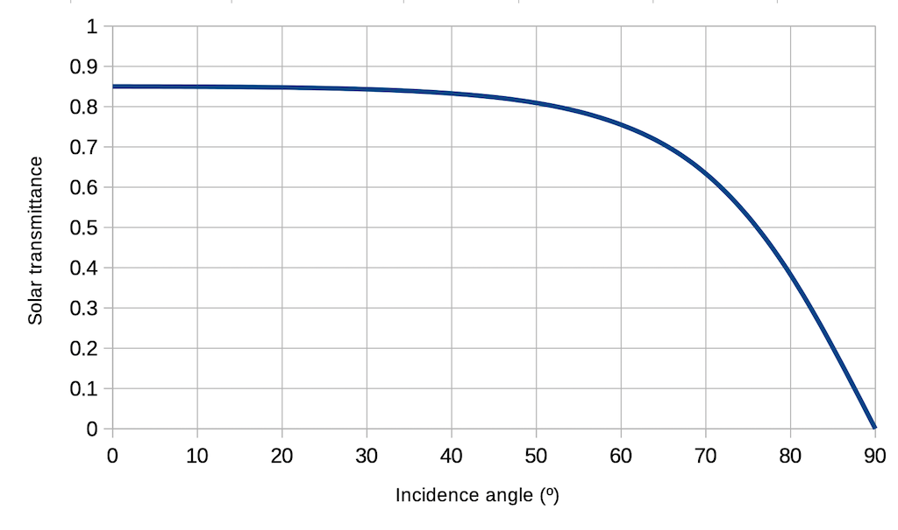
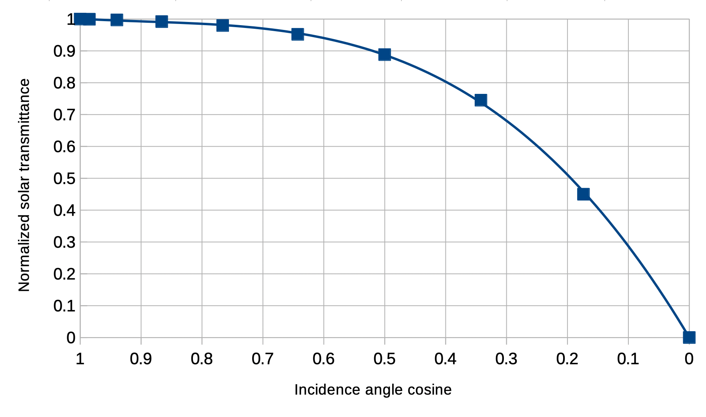
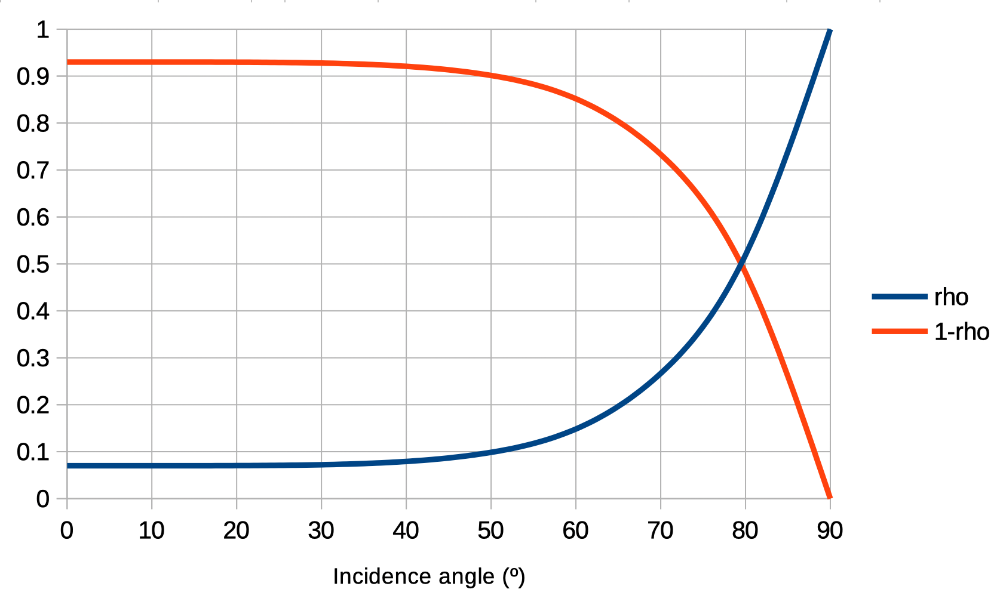
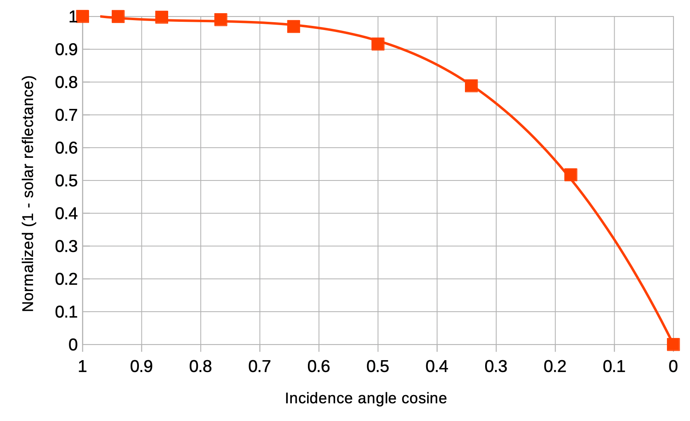

## Component List for constructive elements

### Material

Component to describe the thermal characteristics of the materials used in the enclosures (Construction component).

#### Parameters
- **conductivity** [_float_, unit = "W/(n·K)", default = 1, min = 0]: Material thermal conductivity. 
- **density** [_float_, unit = "kg/m³", default = 1000, min = 0.001]: Material Density.
- **specific_heat** [_float_, unit = "J/(kg·K)", default = 1000, min = 0.001]: Material specific heat.
- **use_resistance** [_boolean_, default = False]: If the value is "False", conductivity, density and specific heat will be used. For "True" value, thermal resistance, density and specific heat will be used. 
- **thermal_resistance** [_float_, unit = "(m²·K)/W", default = 1, min = 0]: Thermal resistance of material layer.

**Example:**
<pre><code class="python">
...

material = pro.new_component("Material","concrete")
param = {
    "conductivity": 1.95,
    "density": 2240,
    "specific_heat": 900,
}
material.set_parameters(param)
</code></pre>

### Construction

Component to describe the composition of the different layers (Material component) of an enclosure.

#### Parameters
- **solar_alpha** [_float-list_, unit = "frac", default = [0.8,0.8], min = 0, max = 1]: Solar absortance for surfaces 1 and 2.
- **lw_epsilon** [_float-list_, unit = "frac", default = [0.9,0.9], min = 0, max = 1]: Long wave emissivity for surfaces 1 and 2.
- **materials** [[_component-list_, default = [], component type = Material]]: Materials list for each of the layers, defined from surface 1 to 2.
- **thicknesses** [_float-list_, unit = "m", default = [], min = 0]: Thicknesses of each of the layers defined in the "materials" parameter. Must have the same number of elements as the "materials" parameter.

**Example:**
<pre><code class="python">
...

construction = pro.new_component("Construction","Multilayer wall")
param = {
    "solar_alpha": [0.8, 0.8],
    "materials": ["Gypsum board","EPS board","Heavyweight concrete","EPS board","Stucco"],
    "thicknesses": [0.016, 0.076, 0.203, 0.076, 0.025],
}
construction.set_parameters(param)
</code></pre>

### Glazing

Component to describe the glazings. Default values are those of a clear single pane of 6 mm thickness.

#### Parameters
- **solar_tau** [_float_, unit = "frac", default = 0.849, min = 0, max = 1]: Solar transmittance of glass at normal incidence.
- **solar_rho** [_float-list_, unit = "frac", default = [0.077,0.077], min = 0, max = 1]: Solar reflectance of glass at normal incidence, for surfaces 1 and 2.
- **lw_epsilon** [_float-list_, unit = "frac", default = [0.837,0.837], min = 0, max = 1]: Long wave emissivity, for surfaces 1 and 2.
- **g** [_float-list_, unit = "frac", default = [0.867093,0.867093], min = 0, max = 1]: Solar factor at normal incidence, calculated according to EN 410:2011, for surfaces 1 and 2.
- **U** [_float_, unit = "W/m²K", default = 5.686, min = 0]: Thermal transmittance of glazing calculated according to EN 673:2011.
- **f_tau_nor** [[_math-exp_, default = "1.3186 * cos_theta ** 3 - 3.5251 * cos_theta **2 + 3.2065 * cos_theta"]: Normalised curve of the variation of solar transmittance, depending on the cosine of the angle of incidence, _cos_theta_ (0º, at normal incidence).
- **f_1_minus_rho_nor** [[_math-exp-list_, default = ["1.8562 * cos_theta ** 3 - 4.4739 * cos_theta ** 2 + 3.6177 * cos_theta", "1.8562 * cos_theta ** 3 - 4.4739 * cos_theta ** 2 + 3.6177 * cos_theta"]]: Normalised curve of the variation for (1 - solar reflectance), depending on the cosine of the angle of incidence, _cos_theta_ (0º, at normal incidence).

To obtain the solar transmittance at an angle of incidence theta, the component shall multiply the value at normal incidence _solar_tau_ by the value of the curve _f_tau_nor_.

The following pictures show the solar transmittance of a single glazing as a function of the angle of incidence, and the normalised curve as a function of the cosine of the angle of incidence.

To obtain the angular reflectance for each side, multiply the normal incidence value _solar_rho_ by the value of the expression: (1 - _f_1_minus_rho_nor_). 

We use the normalisation of (1 - reflectance) since the reflectance tends to 1 when the angle of incidence tends to 90º and the value we use to normalise is the reflectance at normal incidence (0º).

The following pictures show the solar reflectance and (1- solar reflectance) of a single glazing as a function of the angle of incidence, and the normalised curve as a function of the cosine of the angle of incidence.

**Example:**
<pre><code class="python">
...

glazing = pro.new_component("Glazing","Double_glazing")
param = {
    "solar_tau": 0.731,
    "solar_rho": [0.133,0.133],
    "g": [0.776, 0.776],
    "U": 2.914,
    "f_tau_nor": "-0.3516 * cos_theta ** 3 - 0.6031 * cos_theta ** 2 +1.9424 * cos_theta",
    "f_1_minus_rho_nor: ["0.9220 * cos_theta ** 3 - 2.8551 * cos_theta ** 2 + 2.9327 * cos_theta", "0.9220 * cos_theta ** 3 - 2.8551 * cos_theta ** 2 + 2.9327 * cos_theta"]
}
glazing.set_parameters(param)
</code></pre>

### Frame

Component to describe the thermal properties of frames used in Opening_types.

#### Parameters
- **solar_alpha** [_float-list_, unit = "frac", default = [0.8,0.8], min = 0, max = 1]: Solar absortance for surfaces 1 and 2.
- **lw_epsilon** [_float-list_, unit = "frac", default = [0.9,0.9], min = 0, max = 1]: Long wave emissivity, for surfaces 1 and 2.
- **thermal_resistance** [_float_, unit = "m²K/W", default = 0.2, min = 0]: Average surface-to-surface thermal resistance of the frame.

**Example:**
<pre><code class="python">
...

frame = pro.new_component("Frame","metal_frame")
param = {
    "solar_alpha": [0.6, 0.6],
    "thermal_resistance": 0.35
}
frame.set_parameters(param)
</code></pre>

### Opening_type

Component for defining the composition of façade openings in buildings. For example windows or doors. 

#### Parameters
- **glazing** [_component_, default = "not_defined", component type = Glazing]: Reference to the "Glazing" component used.
- **frame** [_component_, default = "not_defined", component type = Frame]: Reference to the "Frame" component used.
- **construction** [_component_, default = "not_defined", component type = Glazing]: Reference to the "Construction" component used. If the opaque part of an opening is defined by a constraction, it will always be assumed to be in steady state for thermal calculations.
- **glazing_fraction** [_float_, unit = "frac", default = 0.9, min = 0, max = 1]: Fraction of the opening made up of a glazing.
- **frame_fraction** [_float_, unit = "frac", default = 0.1, min = 0, max = 1]: Fraction of the opening made up of a frame.

if the glazing_fraction plus the frame_fraction is less than 1 the rest of the area is assumed to be opaque and formed by the defined cosntruction.

**Example:**
<pre><code class="python">
...

double_glazed_window = pro.new_component("Opening_type","double_glazed_window")
param = {
    "glazing": "double_glazing",
    "frame": "wood_frame",
    "glazing_fraction": 0.8,
    "frame_fraction": 0.2
}
double_glazed_window.set_parameters(param)
</code></pre>

