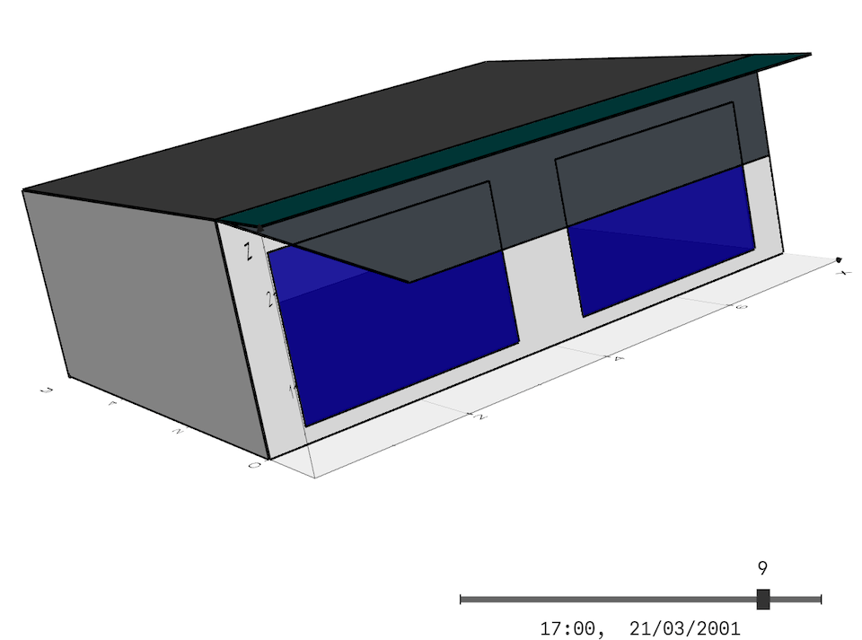
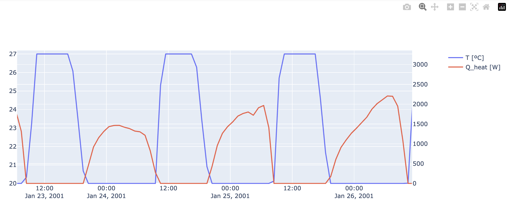
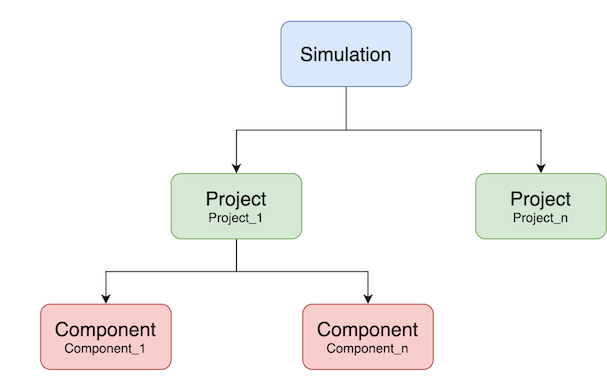
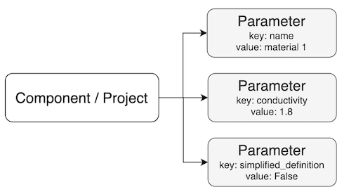
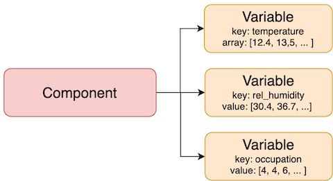

 

This site contains the documentation for the
___opensimula___ project. Github site 

`opensimula` is a component-based time simulation environment in Python. 

The main objective is the thermal and energy simulation of different systems and installations, mainly in buildings, although it can be used to simulate any component that presents a temporal variation.

### Structure

The general object structure provided by opensimula is composed of three main elements:

- Simulation: The global environment for simulation.
- Project: A set of components that define a problem that can be temporarily simulated.
- Component: These are the base elements on which the simulation is performed. The types of components currently available can be consulted in section [Component list](component_list.md).

### Parameters

**Parameters** are used to define the characteristics that make up the projects and components. 

Parameters can be of different types depending on the type of information they contain (strings, boolean, integer, float, options, ...). A list of all parameter types and their possibilities can be found in the [User guide](user_guide.md#parameters). :

### Variables

**Variables** are elements included in the components to store the temporal 
information generated during the simulation.

## Documentation

1. [Getting started](getting_started.md)
2. [User guide](user_guide.md)
3. [Component list](component_list.md)
3. [Developer guide](developer_guide.md)

## Release notes

This is the list of changes to opensimula between each release. For full details, see the commit logs.

 __Current Version 0.6.1__

- 0.6.1 (February 17, 2026): Building_surface ground-coupled "UNDERGROUND" surfeca passed ASHHRAE 140 Section 8 Tests.
- 0.6.0 (October 30, 2025): HVAC_MZW_system passed ASHHRAE 140 Tests.
- 0.5.2 (October 2, 2025): Changed the name of the pypi package from OpenSimula to opensimula. HVAC_MZW_system under development.
- 0.5.0 (September 30, 2025): Surfaces grouped into Building_surface and Solar_surface. Use of the VEDO library for 3D visualization 
- 0.4.1 (March 13, 2025): Stable versions of HVAC_DX_system and DX_unit. Passed all cases of section 9. 
- 0.4.2 (June 11, 2025): WYEC2 Files added to "File_met", New "Water_coil" and "Fan" added, HVAC_DX_system and DX_unit adjusted, New HVAC_SZW_system (Single Zone Water System) created.
- 0.4.1 (March 13, 2025): Stable versions of HVAC_DX_system and DX_unit. Passed all cases of section 9. “Space-cooling equipment performance tests” of ASHRAE 140-2023.
- 0.3.2 (February 20, 2025): Debugging HVAC_DX_system and DX_unit. Passed cases CE100 to CE340 of section 9. “Space-cooling equipment performance tests” of ASHRAE 140-2023.
- 0.3.1 (January 24, 2025): Implementation HVAC_DX_system and DX_unit
- 0.2.0 (January 1, 2025): First implementation for the building definition components and the HVAC_perfect_system

_© JFC 2026_
